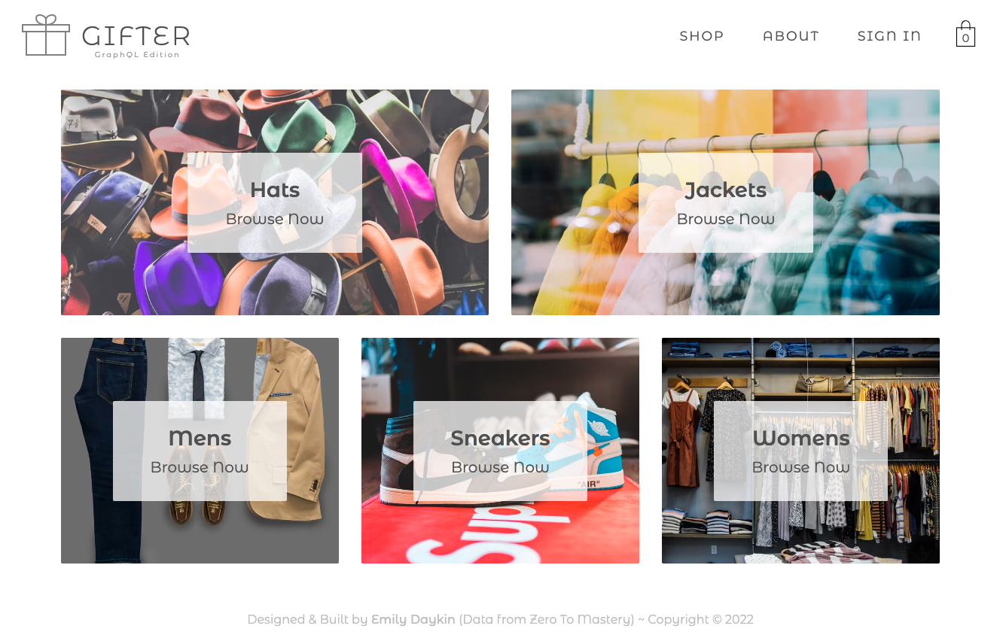

# GraphQL

This app wraps **GraphQL** and **Apollo** around [Gifter v1](https://github.com/emilydaykin/Gifter/tree/v1) with minor styling adjustments. The goal of this spin-off repo was to practise integrating GraphQL on the front end via Apollo Client, and writing queries to fetch data from a provided server.

<p align="center">
  
</p>

## Installation:
This application is not deployed. To see it in action, run it locally:
1. Clone this repo
2. Run `yarn` from the root directory to install necessary packages and dependencies
3. Run `yarn start` from the root directory to spin up the client

## Code Snippets:

#### Wrapping GraphQL around the App using Apollo Client 
```javascript
const client = new ApolloClient({
  uri: 'https://crwn-clothing.com/',
  cache: new InMemoryCache()
});

const root = ReactDOM.createRoot(document.getElementById('root'));
root.render(
  <React.StrictMode>
    <ApolloProvider client={client}>
      ...
        <App />
      ...
    </ApolloProvider>
  </React.StrictMode>
);

```

#### Fetching all categories from database in React Context
```javascript
import { createContext, useState, useEffect } from 'react';
import { gql, useQuery } from '@apollo/client';

export const CategoriesContext = createContext({
  categoriesMap: {}
});

const COLLECTIONS = gql`
  query {
    collections {
      id
      title
      items {
        id
        name
        price
        imageUrl
      }
    }
  }
`;

export const CategoriesProvider = ({ children }) => {
  const { loading, error, data } = useQuery(COLLECTIONS);
  const [categoriesMap, setCategoriesMap] = useState({});

  useEffect(() => {
    if (data) {
      const { collections } = data;
      const collectionsMap = collections.reduce((acc, collection) => {
        const { title, items } = collection;
        acc[title.toLowerCase()] = items;
        return acc;
      }, {});
      setCategoriesMap(collectionsMap);
    }
  }, [data]);

  const value = { categoriesMap, loading };
  return <CategoriesContext.Provider value={value}>{children}</CategoriesContext.Provider>;
};

```

#### Dynamically fetching (via useParams) a specific category (using query variables) from database
```javascript
...
import { gql, useQuery } from '@apollo/client';

const GET_CATEGORY = gql`
  query ($title: String) {
    getCollectionsByTitle(title: $title) {
      id
      title
      items {
        id
        name
        price
        imageUrl
      }
    }
  }
`;

const Category = () => {
  const { category } = useParams();

  const { loading, error, data } = useQuery(GET_CATEGORY, {
    variables: {
      title: category
    }
  });

  useEffect(() => {
    if (data) {
      const {
        getCollectionsByTitle: { items }
      } = data;
      setProducts(items);
    }
  }, [category, data]);

  const [products, setProducts] = useState([]);

  return(
    ...
  )
}
```

## Challenges:
The way the [Apollo Client URI](https://crwn-clothing.com/) was created was quite black-box to me. I tried replicating it by learning about Prisma as a layer between my Firestore database (where my Gifter [data](https://github.com/emilydaykin/Gifter/blob/main/src/data/shop-data.js) sits) and this client application, but I haven't yet found a way to link my Firestore to Prisma (to create a GraphQL Playground and Server) to then link to Apollo GraphQL in the front end.
